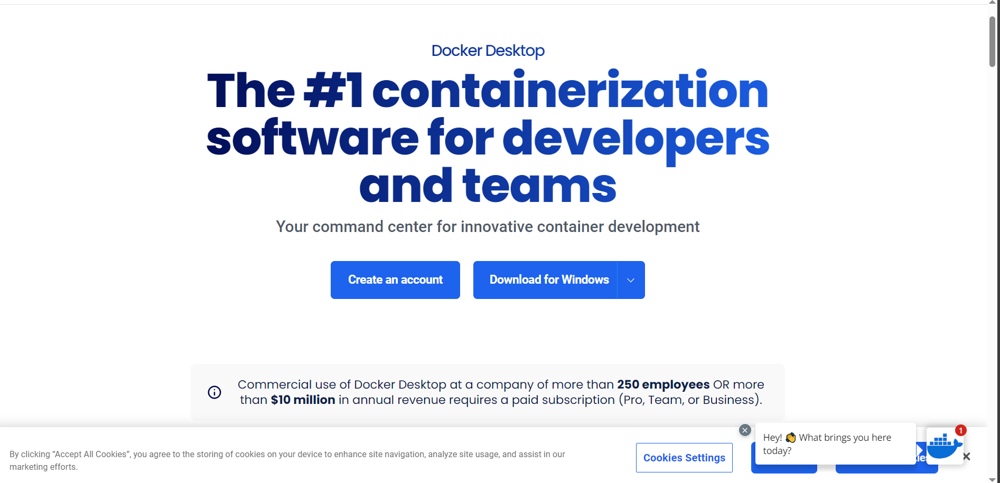

# local 포팅 매뉴얼

## docker & docker-compose 설치

- GUI가 있는 환경에서는 docker desktop 설치

<Details>
<summary>서버에서 docker CLI 설치</summary>

### 1. 시스템 업데이트
```shell
sudo apt update
```

### 2. 필요한 의존성 패키지 설치
```shell
sudo apt install -y apt-transport-https ca-certificates curl software-properties-common
```

### 3. Docker 공식 GPG 키 추가:
```shell
curl -fsSL https://download.docker.com/linux/ubuntu/gpg | sudo gpg --dearmor -o /usr/share/keyrings/docker-archive-keyring.gpg
```

### 4. Docker repository 추가:
```shell
echo "deb [arch=amd64 signed-by=/usr/share/keyrings/docker-archive-keyring.gpg] https://download.docker.com/linux/ubuntu $(lsb_release -cs) stable" | sudo tee /etc/apt/sources.list.d/docker.list > /dev/null
```

### 5. Docker 설치:
```shell
sudo apt update
sudo apt install docker-ce
```

### 6. Docker 서비스 시작:
```shell
sudo systemctl start docker
```

### 7. 부팅 시 자동 시작 설정:
```shell
sudo systemctl enable docker
```

### 8. Docker 그룹에 현재 사용자 추가 (sudo 권한 없이 Docker 명령을 사용하기 위함, 로그아웃 후 다시 로그인):
```shell
sudo usermod -aG docker $USER
```
- 사용자를 Docker 그룹에 추가한 후에는 로그아웃하고 다시 로그인해야 변경 사항이 적용

### 9. Docker 설치 확인:
```shell
docker --version
```
- Docker가 정상적으로 설치되었다면 버전을 확인할 수 있다.

</Details>

<Details>
<summary>서버에서 docker-compose 설치</summary>

```shell
sudo curl -L "https://github.com/docker/compose/releases/download/1.27.4/docker-compose-$(uname -s)-$(uname -m)" -o /usr/local/bin/docker-compose
```
- curl 명령어를 통해 docker-compose를 설치합니다.

```shell
sudo chmod +x /usr/local/bin/docker-compose
```
- 다운로드한 도커 컴포즈 파일을 실행 가능하도록 다운로드한 경로에 권한을 부여합니다.

```shell
  sudo ln -s /usr/local/bin/docker-compose /usr/bin/docker-compose
```
- 심볼릭 링크 설정으로 path 경로를 아래와 같이 설정해줍니다.

```shell
docker-compose -v
```
- 정상적으로 설치되었는지 확인합니다.

</Details>


## 로컬에서 실행해 보기
### 이동
```shell
cd /S10P12A502/exec/docker/
```
- 프로젝트의 `exec/docker` 폴더로 이동

### docker-compose 실행
```shell
docker-compose up
```
- docker-compose 실행

### data 넣기
```shell
sudo docker cp ./S10P12A502/exec/docker/dotori-back/dotori_data.sql dotori-mysql:/
sudo docker exec dotori-mysql bash
mysql -u root -p dotori < dotori_data.sql
```
- password를 `root-dotori`로 입력 하고, `exit`

### 브라우저 열기
```text
http://localhost:9000
```
- 위 url로 이동하여 웹 실행


## 실행 시 주의 할 점
1. docker를 반드시 설치해주세요.
2. 처음 실행 시 docker-image를 다운로드 하고, docker안에서 빌드가 이루어 지기 때문에 5 ~ 10분이 소요될 수 있습니다.
3.  사용하고 있는 포트 충돌으로 실행 되지 않을 수 있습니다. 아래 포트들 중 사용중인 포트를 확인해 주세요.
    - `80`, `443`, `4443`, `8080`, `9000` 
